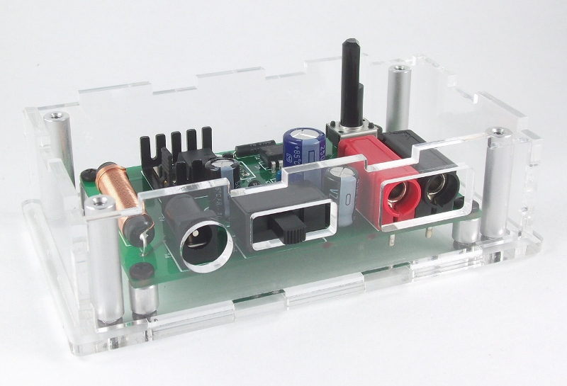
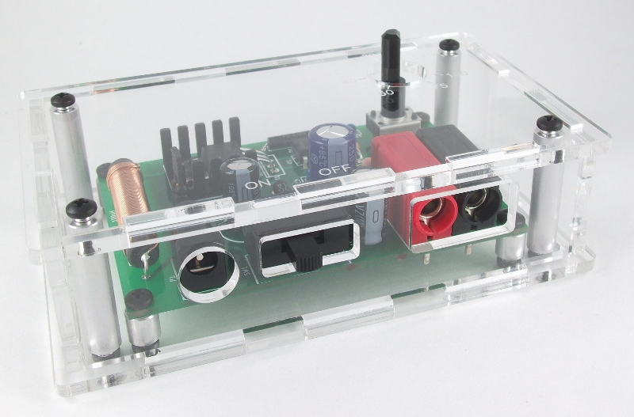

Assembly Step 2: Enclosure assembly
=====================================

Assembly Instructions
-----------------------

Mount the assembled PCB onto the acrylic enclosure base
^^^^^^^^^^^^^^^^^^^^^^^^^^^^^^^^^^^^^^^^^^^^^^^^^^^^^^^^^
Mount the assembled PCB onto the four short (1/4") round standoffs using the four smaller (3/16") screws and mount the PCB onto the clear acrylic base with four of the 1/4" screws.

Place the four longer (1") round standoffs in each corner
^^^^^^^^^^^^^^^^^^^^^^^^^^^^^^^^^^^^^^^^^^^^^^^^^^^^^^^^^^^
The standofs are used to secure the top and the enclosure.

.. figure:: image_15b.JPG
   :align:  center

Place the four sides onto the clear base
^^^^^^^^^^^^^^^^^^^^^^^^^^^^^^^^^^^^^^^^^

Place the top onto the case and secure with the remaining four 1/4" screws
^^^^^^^^^^^^^^^^^^^^^^^^^^^^^^^^^^^^^^^^^^^^^^^^^^^^^^^^^^^^^^^^^^^^^^^^^^^^^^^^^^^^^^^^^^^^^^^^^^^^^^^^^^

Mount the knob onto the flat side of the potentiometer. 
^^^^^^^^^^^^^^^^^^^^^^^^^^^^^^^^^^^^^^^^^^^^^^^^^^^^^^^^^^^^^^^^^
With this style of button, there is a notch which you line up with the flat side of the potentiometer. Push the button all the way down onto the potentiometer. It is a tight fit so you have to push with some force but the knob should fit into the top hole on the enclosure.

Image of the final assembled device 
^^^^^^^^^^^^^^^^^^^^^^^^^^^^^^^^^^^^^^^^^^^^^^^^^^^^^^^^^^^^^^^^^

