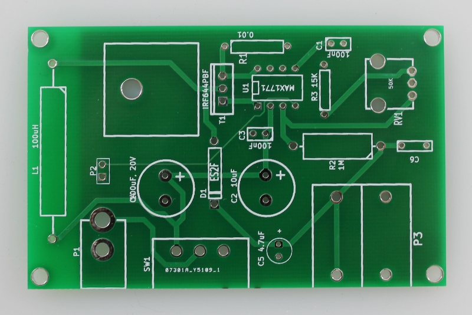

Power supply PCB and components
=================================

Each electrophoresis power supply kit includes the following PCB and components.

Power supply PCB v1.3
------------------------

PCB components
---------------------

.. figure:: image_4.png
   :align:  center
    
Table of components and vendors
^^^^^^^^^^^^^^^^^^^^^^^^^^^^^^^^^^^

===== =========   ======  =========================  ========   ======================
Part  Position    Qty     Description                Vendor      PN                  
===== =========   ======  =========================  ========   ======================
1     L1          1       100uH power inductor        Digikey    M8271-ND	
2     SW1         1       slide switch                Digikey    CKC5102-ND	
3     P1          1       DC Jack, 2.1mm              Jameco     137673
4     P2          1       Jumper                      Jameco
5     P2          1       2x1 pin array               Digikey    SAM1031-50-ND
6     C1, C3      2       100nF, 50V capacitor        Digikey    445-5258-ND	
7     RV1	      1       Knob
8     U1          1       TO220 vertical heat sink    Digikey    A10764-ND
9     T1          1       IRF644 transistor (FET)     Digikey    IRF644PBF-ND
10    RV1         1       50 K Rotary potentiometer   Digikey    P3C3503-ND	
11    P3          2       banana jacks                Newark     80P3613 & 80P3616	
12    U1          1       MAX1771 DC-DC controller    Digikey    MAX1771CPA+-ND	
13    D1          1       ES2F Diode                  Digikey    EGP20G-E3/54GICT-ND	
14    R1          1       Resistor: 0.01 ohm, 1 W     Digikey    LVRA-.01RCT-ND	
15    R3          1       Resistor: 15 K, 1 W         Digikey    15KWCT-MD	
16    R2          1       Resistor: 1 M, 1/2 W        Digikey    1MGBCT-ND	
17    C6          1       Capacitor: 100 nF, 250 V    Digikey    P10967-ND	
18    C4          1       Capacitor: 100 uF, 50 V     Digikey    P15369CT-ND	
19    C5          1       Capacitor: 4.7 uF, 250 V    Digikey    493-1414-ND	
20    C2          1       Capacitor: 10 uF, 250 V     Digikey    P5334-ND	
===== =========   ======  =========================  ========   ======================

