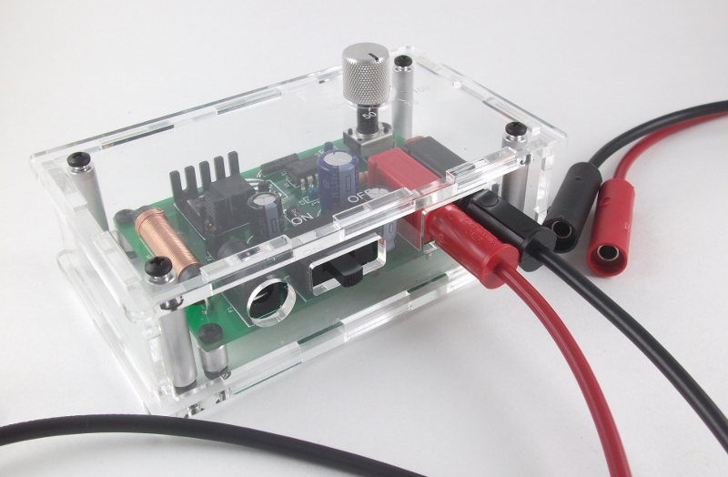

.. Electrophoresis power supply documentation master file, created by
   sphinx-quickstart on Thu Dec 19 16:30:43 2013.
 
Open source DIY Kit
========================================================
Documentation for making the variable (25-100V) `electrophoresis power supply <http://www.iorodeo.com/content/electrophoresis-power-supply-kit>`_. 

License
---------------
This is an open source hardware project licensed under the `Creative Commons Attribution 3.0 License <http://creativecommons.org/licenses/by/3.0>`_. 

Design files
------------------

* KiCad PCB design and Gerber files -  https://bitbucket.org/iorodeo/hv_switching_psu  
* Acrylic enclosure - https://bitbucket.org/iorodeo/hv_switching_psu_enclosure.

Kit Contents
------------------
Electrophoresis power supply kit, Cat # `IMG-08 <http://www.iorodeo.com/content/electrophoresis-power-supply-kit>`_ includes the following parts:

* Electrophoresis power supply PCB v1.3
* Electronic components: 20 through-hole components 
* Enclosure laser cut parts: 1/8" clear acrylic 
* Enclosure hardware: Standoffs, machine screws and a mini screwdriver

Additional equipment
---------------------------
* Soldering equipment
* Wire clippers
* Multimeter for testing
* 15V, 1.6A DC power supply: 2.1mm plug, center +ve, e.g. Jameco Cat # 380173
* Banana plug/banana jack cords: e.g. Pomona Electronics Cat # 4702-24-0 (black, 24") and 4702-24-2 (red, 24").

Note that the 15V power supply and banana plug/banana jack cords can be purchased with the kit.

Table of Contents
====================

Kit Contents
--------------
.. toctree::
   :maxdepth: 2

   intro.rst
   components.rst
   enclosure.rst

Assembly Instructions
-----------------------
.. toctree::
   :maxdepth: 2

   assembly_step1.rst
   assembly_step2.rst
   assembly_step3.rst

Search
==================

* :ref:`search`

